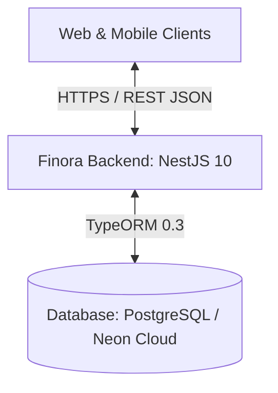

# System Architecture

Tài liệu mô tả kiến trúc tổng thể, mô hình phân lớp và cấu trúc thành phần của hệ sinh thái **Finora Backend** (`finora_be`).

---

## 1. Tổng Quan Hệ Thống

Finora Backend là nền tảng cung cấp RESTful API hiệu năng cao, bảo mật và khả năng mở rộng tốt, phục vụ các ứng dụng Web Client và Mobile Client trong hệ sinh thái quản lý tài chính Finora.



### Các Tiêu Chí Thiết Kế Cốt Lõi:
- **Clean Layered Architecture:** Tách biệt rõ ràng giữa tầng Routing (Controller), Nghiệp vụ (Service), Truy xuất dữ liệu (Repository), và Chuyển đổi dữ liệu (Mapper).
- **Feature-based Modular Structure:** Mỗi module nghiệp vụ độc lập, tự đóng gói toàn bộ logic và tài nguyên.
- **Strict Data Integrity:** Quản lý schema 100% bằng migration thủ công (tắt `synchronize`).
- **Standardized API Response:** Mọi endpoint trả về định dạng đồng nhất qua `ResponseInterceptor`.

---

## 2. Công Nghệ Sử Dụng (Technology Stack)

| Tầng / Thành phần | Công nghệ | Mục đích & Đặc điểm nổi bật |
| :--- | :--- | :--- |
| **Framework** | **NestJS 10** | TypeScript, Dependency Injection, Modular architecture. |
| **ORM & Driver** | **TypeORM 0.3 + pg** | Code-first Entity, manual migrations, connection pooling qua `pg`. |
| **Database** | **PostgreSQL (Neon Cloud)** | Serverless Postgres, SSL connection string, ràng buộc dữ liệu nghiêm ngặt. |
| **Validation** | **class-validator + class-transformer** | Tự động kiểm tra và làm sạch DTO request qua Global ValidationPipe. |
| **API Docs** | **Swagger / OpenAPI** | Tự động sinh tài liệu API trực quan tại `/docs` qua decorator `@SwaggerDoc`. |
| **Testing** | **Jest 29 + NestJS Testing** | Unit tests cô lập 3 tầng (Controller, Service, Repository) với mock data. |

---

## 3. Cấu Trúc Thư Mục (Directory Layout)

```text
finora_backend/
├── docs/                           # Tài liệu kỹ thuật dự án
│   ├── architecture.md             # Tài liệu kiến trúc hệ thống
│   ├── coding-conventions.md       # Quy chuẩn viết code & API response
│   ├── database-migration-guide.md # Hướng dẫn chi tiết tạo & chạy Migration
│   ├── database.md                 # Tổng quan truy xuất CSDL
│   ├── development-workflow.md     # Quy trình làm việc & Git commit
│   ├── module-development-guide.md # Hướng dẫn phát triển Module mẫu 8 bước
│   └── testing-guide.md            # Hướng dẫn viết Unit Test toàn diện
├── src/
│   ├── common/                     # Tầng dùng chung toàn hệ thống
│   │   ├── entities/base.entity.ts # BaseEntity: id (UUID v4), created_at, updated_at, deleted_at
│   │   ├── enums/                  # Enums chung (SortOrder...)
│   │   ├── errors/                 # AppError, ErrorCodes, helper exceptions
│   │   ├── filters/                # HttpExceptionFilter, TypeOrmExceptionFilter
│   │   ├── interceptors/           # ResponseInterceptor chuẩn hóa JSON response
│   │   ├── response/               # ApiResponse, PaginatedResponse format
│   │   └── swagger/                # Decorator @SwaggerDoc tổng hợp
│   ├── config/                     # Cấu hình hệ thống & biến môi trường
│   │   ├── app.config.ts           # PORT, APP_URL, FRONTEND_URL, NODE_ENV
│   │   ├── database.config.ts      # DATABASE_URL
│   │   └── validation.schema.ts    # Joi schema validate biến môi trường
│   ├── database/                   # TypeORM DataSource & Migrations
│   │   ├── data-source.ts          # AppDataSource dùng cho TypeORM CLI
│   │   ├── migrations/             # Thư mục chứa các file migration SQL
│   │   └── scripts/                # Helper scripts tạo & chạy migration thuận tiện
│   ├── modules/                    # Các module tính năng độc lập
│   │   └── products/               # Module mẫu chuẩn Clean Architecture
│   │       ├── dto/                # Request & Response DTOs
│   │       ├── entities/           # TypeORM Entities (Product)
│   │       ├── exceptions/         # Domain exceptions (ProductNotFoundException...)
│   │       ├── mapper/             # Mapper Entity -> Response DTO
│   │       ├── repository/         # Custom Repository với QueryBuilder
│   │       ├── products.controller.ts
│   │       ├── products.service.ts
│   │       ├── products.constant.ts
│   │       └── products.module.ts
│   ├── shared/                     # Module chia sẻ cấp hạ tầng
│   │   └── database/               # DatabaseModule kết nối TypeORM root
│   ├── app.module.ts               # Root AppModule
│   └── main.ts                     # Entry point khởi tạo ứng dụng NestJS
├── test/                           # Unit Tests & E2E Tests
└── package.json
```

---

## 4. Kiến Trúc Phân Lớp (Clean Layered Architecture)

Mỗi request từ client được xử lý tuần tự qua các lớp:

```text
HTTP Request
     │
     ▼
[ValidationPipe] ────── Validate DTO đầu vào, loại bỏ thuộc tính rác
     │
     ▼
[Controller] ────────── Định tuyến endpoint, gắn @SwaggerDoc, nhận DTO
     │
     ▼
[Service] ───────────── Thực thi quy tắc nghiệp vụ, kiểm tra ràng buộc logic
     │
     ▼
[Repository] ────────── Xây dựng QueryBuilder, phân trang, lọc, sắp xếp DB
     │
     ▼
[Database] ──────────── PostgreSQL / Neon Cloud
     │
     ▼
[Mapper] ────────────── Chuyển đổi Entity sang Response DTO (không rò rỉ cấu trúc bảng)
     │
     ▼
[ResponseInterceptor] ─ Bọc dữ liệu vào chuẩn ApiResponse đồng nhất
     │
     ▼
HTTP Response
```

---

## 5. Thiết Kế Bảo Mật & Toàn Vẹn Dữ Liệu

1. **Xác thực DTO đầu vào:** Global `ValidationPipe` với `whitelist: true` và `forbidNonWhitelisted: true` đảm bảo payload không chứa dữ liệu lạ ngoài khai báo DTO.
2. **Xử lý Ngoại lệ Tập trung:** `TypeOrmExceptionFilter` và `HttpExceptionFilter` bắt mọi lỗi runtime, ẩn giấu câu lệnh SQL nội bộ để bảo mật và trả về mã lỗi `AppError` thân thiện.
3. **Quản lý Migration Chặt chẽ:** Tắt `synchronize`, mọi thay đổi cấu trúc bảng bắt buộc phải trải qua migration file để kiểm soát version trong Git.