# Finora Backend — Entity Relationship Diagram (ERD)

Sơ đồ thực thể liên kết (ERD) thuần nghiệp vụ của hệ thống **Finora**, tập trung vào các thực thể cốt lõi và các mối quan hệ (1 - 1, 1 - N, N - N), đã loại bỏ các trường kỹ thuật kiểm toán (`created_at`, `updated_at`, `deleted_at`) và các bảng hạ tầng Auth/RBAC.

---

## 1. Sơ đồ ERD (Mermaid Diagram)

```mermaid
erDiagram
    User ||--o| UserSetting : "has"
    User ||--o{ AiPersona : "owns"
    User ||--o{ Wallet : "owns"
    Wallet ||--o{ WalletMember : "has_members"
    User ||--o{ WalletMember : "joins"
    Wallet ||--o{ Account : "contains"
    
    User ||--o{ Category : "creates"
    Category ||--o{ Category : "parent_children"
    
    Account ||--o{ Transaction : "records"
    User ||--o{ Transaction : "creates"
    Category ||--o{ Transaction : "classifies"
    Transaction ||--o{ TransactionPhoto : "has"
    
    Account ||--o{ Receipt : "bills"
    Receipt ||--o{ ReceiptItem : "contains"
    Category ||--o{ ReceiptItem : "classifies"
    Receipt ||--o{ Transaction : "generates"
    
    Account ||--o{ Transfer : "source_account"
    Account ||--o{ Transfer : "dest_account"
    Account ||--o{ Transfer : "fee_account"
    User ||--o{ Transfer : "executes"
    
    Wallet ||--o{ Budget : "manages"
    Category ||--o{ Budget : "applies_to"
    
    Wallet ||--o{ RecurringTransaction : "schedules"
    Account ||--o{ RecurringTransaction : "charges"
    Category ||--o{ RecurringTransaction : "classifies"
    User ||--o{ RecurringTransaction : "creates"
    
    Wallet ||--o{ SavingsGoal : "targets"
    Account ||--o{ SavingsGoal : "funds"
    SavingsGoal ||--o{ SavingsContribution : "receives"
    Account ||--o{ SavingsContribution : "deposits"
    
    Wallet ||--o{ Loan : "manages"
    Account ||--o{ Loan : "disburses"
    User ||--o{ Loan : "created_by"
    Loan ||--o{ LoanPayment : "settles"
    Account ||--o{ LoanPayment : "pays_from"
    
    User ||--o{ ChatMessage : "sends"
    Wallet ||--o{ ChatMessage : "context"
    
    User ||--o{ Friendship : "requester"
    User ||--o{ Friendship : "addressee"
    
    Transaction ||--o{ PostReaction : "receives"
    User ||--o{ PostReaction : "reacts"
    
    User ||--o{ DirectMessage : "sender"
    User ||--o{ DirectMessage : "receiver"
    DirectMessage ||--o| DirectMessage : "replies_to"
    Transaction ||--o{ DirectMessage : "references"
    DirectMessage ||--o{ MessageReaction : "receives"
    User ||--o{ MessageReaction : "reacts"
    
    User ||--o{ Notification : "receives"

    User {
        uuid id PK
        string email UK
        string phone
        string full_name
        string avatar_url
    }

    UserSetting {
        uuid id PK
        uuid user_id FK,UK
        string default_currency
        string language
        boolean app_lock_enabled
        string pin_hash
        boolean show_mascot
        boolean biometric_enabled
        json notification_preferences
        string default_transaction_visibility
    }

    AssetTier {
        uuid id PK
        string tier_name UK
        decimal min_net_worth
        decimal max_net_worth
        string mascot_asset_url
        string display_name
        int display_order
    }

    AiPersona {
        uuid id PK
        uuid user_id FK
        string name
        text tone_description
        text system_prompt_snippet
        boolean is_active
    }

    Wallet {
        uuid id PK
        uuid owner_id FK
        string name
        string icon
        string color
        text description
        string default_currency
        enum type "PERSONAL | SHARED"
        boolean is_shared
        boolean is_archived
    }

    WalletMember {
        uuid id PK
        uuid wallet_id FK
        uuid user_id FK
        enum role "OWNER | EDITOR | VIEWER"
    }

    Account {
        uuid id PK
        uuid wallet_id FK
        string name
        enum type "CASH | BANK_ACCOUNT | E_WALLET | CREDIT_CARD | OTHER"
        string currency
        decimal balance
        decimal available_balance
        string account_number_last4
        string bank_code
        string color
        boolean is_archived
        boolean exclude_from_net_worth
    }

    Category {
        uuid id PK
        uuid user_id FK
        uuid parent_id FK
        string name
        enum type "EXPENSE | INCOME | BOTH"
        string color
        string icon
        int display_order
        boolean is_system
    }

    Transaction {
        uuid id PK
        uuid account_id FK
        uuid created_by FK
        uuid category_id FK
        uuid receipt_id FK
        uuid chat_message_id FK
        uuid recurring_transaction_id FK
        enum type "EXPENSE | INCOME"
        decimal amount
        decimal fee
        string currency
        string name
        text note
        enum source "MANUAL | CHAT_TEXT | VOICE | RECEIPT_SCAN | BANK_NOTIFICATION | RECURRING"
        enum status "PENDING_CONFIRMATION | CONFIRMED | REJECTED"
        enum visibility "PRIVATE | FRIENDS"
        boolean amount_hidden
        boolean is_recurring
        boolean exclude_from_report
        string location_name
        decimal latitude
        decimal longitude
        datetime transaction_date
    }

    TransactionPhoto {
        uuid id PK
        uuid transaction_id FK
        string photo_url
        enum type "RECEIPT | MOMENT"
        boolean is_cover
    }

    Receipt {
        uuid id PK
        uuid account_id FK
        string image_url
        string merchant_name
        decimal total_amount
        decimal tax_amount
        decimal tip_amount
        json ocr_raw_data
    }

    ReceiptItem {
        uuid id PK
        uuid receipt_id FK
        uuid category_id FK
        string item_name
        decimal quantity
        decimal unit_price
        decimal total_price
    }

    Transfer {
        uuid id PK
        uuid from_account_id FK
        uuid to_account_id FK
        uuid created_by FK
        uuid fee_account_id FK
        decimal fee
        decimal from_amount
        string from_currency
        decimal to_amount
        string to_currency
        decimal exchange_rate
        text note
        datetime transfer_date
    }

    Budget {
        uuid id PK
        uuid wallet_id FK
        uuid category_id FK
        decimal amount_limit
        enum period "WEEKLY | MONTHLY"
        decimal used_amount
        datetime period_start
        datetime period_end
        boolean rollover_enabled
        int notify_threshold
        boolean is_active
    }

    RecurringTransaction {
        uuid id PK
        uuid wallet_id FK
        uuid account_id FK
        uuid category_id FK
        uuid created_by FK
        string name
        decimal amount
        string currency
        enum type "EXPENSE | INCOME"
        enum frequency "DAILY | WEEKLY | BIWEEKLY | MONTHLY | QUARTERLY | YEARLY"
        datetime start_date
        datetime end_date
        datetime next_run_date
        boolean is_paused
    }

    SavingsGoal {
        uuid id PK
        uuid wallet_id FK
        uuid account_id FK
        string name
        string icon
        string color
        boolean is_favorite
        decimal target_amount
        decimal current_amount
        datetime target_date
        enum status "ACTIVE | COMPLETED | WITHDRAWN | CANCELLED"
    }

    SavingsContribution {
        uuid id PK
        uuid goal_id FK
        uuid account_id FK
        decimal amount
        text note
        datetime contribution_date
    }

    Loan {
        uuid id PK
        uuid wallet_id FK
        uuid account_id FK
        uuid created_by FK
        enum type "LENT | BORROWED | INSTALLMENT"
        string contact_name
        string contact_info
        decimal principal_amount
        decimal remaining_amount
        boolean is_interest_bearing
        decimal interest_rate
        enum interest_period "MONTHLY | YEARLY"
        string currency
        text note
        datetime loan_date
        datetime due_date
        enum status "ACTIVE | SETTLED | OVERDUE"
    }

    LoanPayment {
        uuid id PK
        uuid loan_id FK
        uuid account_id FK
        decimal amount
        text note
        datetime payment_date
    }

    ChatMessage {
        uuid id PK
        uuid user_id FK
        uuid wallet_id FK
        enum role "USER | ASSISTANT"
        enum message_type "TEXT | CHART | TRANSACTION_CONFIRMATION | REPORT"
        text text_content
        json payload_json
    }

    Friendship {
        uuid id PK
        uuid requester_id FK
        uuid addressee_id FK
        enum status "PENDING | ACCEPTED | REJECTED | BLOCKED"
    }

    PostReaction {
        uuid id PK
        uuid transaction_id FK
        uuid user_id FK
        string emoji
    }

    DirectMessage {
        uuid id PK
        uuid sender_id FK
        uuid receiver_id FK
        enum type "TEXT | IMAGE | TRANSACTION_SHARE"
        text content
        string media_url
        uuid reply_to_message_id FK
        uuid related_transaction_id FK
        boolean is_read
    }

    MessageReaction {
        uuid id PK
        uuid message_id FK
        uuid user_id FK
        string emoji
    }

    Notification {
        uuid id PK
        uuid user_id FK
        string type
        string title
        text body
        boolean is_read
        string related_entity_type
        uuid related_entity_id
        json metadata
        string action_url
    }
```

